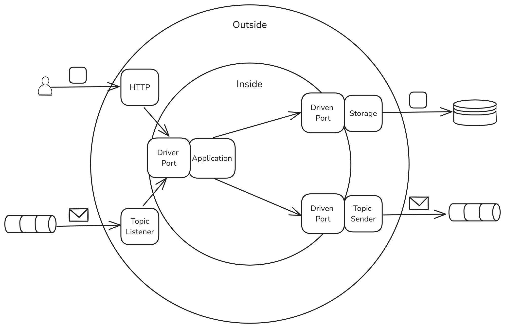

# My House - um experimento hexagonal com spring boot.

> What goes inside the hexagon?
> - Cockburn:  I don't care.

[ref](https://youtu.be/AOIWUPjal60?t=1900)

<p align="center">
  
</p>


### Introdução.

Este projeto, denominado "myhouse", foi desenvolvido utilizando a arquitetura hexagonal (também conhecida como Ports And Adapters) para gerenciar a complexidade do software e manter uma separação clara entre as regras de negócios.

### Estrutura do projeto.


```
src/main/java/com/lobster/myhouse/
|-- domain
|   |-- Family.java
|   |-- Dependent.java
|   |-- Scoring.java
|
|-- application
|   |-- usecases
|   |   |-- RegisterFamiliesUseCase.java
|   |   |-- RegisterFamiliesUseCaseInput.java
|   |   |-- RegisterFamiliesUseCaseOutput.java
|   |-- contracts
|       |-- usecase
|           |-- UseCaseContract.java
|
|-- infrastructure
    |-- http
    |   |-- RegisterFamiliesDto.java
    |   |-- RegisterFamiliesHttp.java
    |-- IoC
    |   |-- UseCaseProvider.java
    |   |-- ScoringProvider.java
    |   |-- adapters
    |       |-- InMemoryRegisterFamiliesAdapter.java

```