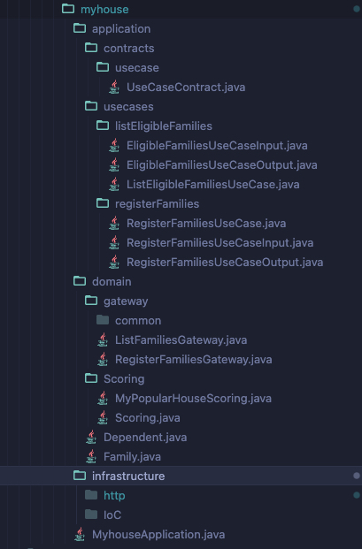
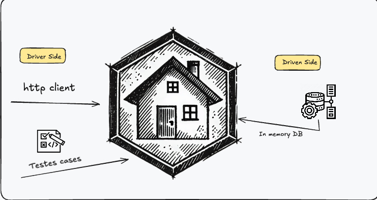

# My House - um experimento hexagonal com spring boot.

> What goes inside the hexagon?
> - Cockburn:  I don't care.

[ref](https://youtu.be/AOIWUPjal60?t=1900)

<p align="center">
  
</p>

> Image from [Vaughn Vernon](https://www.linkedin.com/posts/vaughnvernon_is-this-even-more-useful-based-on-a-lot-activity-7232094732233940992-StfV?utm_source=share&utm_medium=member_desktop)

### Introdução.

Este projeto, denominado "myhouse", foi desenvolvido utilizando a arquitetura hexagonal (também conhecida como Ports And Adapters) para gerenciar a complexidade do software e manter uma separação clara entre as regras de negócios.

### Estrutura do projeto.

<p align="center">
  
</p>

### Configurações do projeto

#### Requisitos:

Java: Versão 17 ou superior.
Maven: Para gerenciamento de dependências e execução de builds.

#### Execução da aplicação:

```bash
./mvnw clean package
```

```bash
docker build -t my-house .
```

```bash
docker run -d -p 8080:8080 --name my-house-container my-house
```

### Exemplos de interação da aplicação:

<p align="center">
  
</p>


#### Interação via HTTP:

<details>
  <summary>Clique para expandir</summary>
  
  ```bash
curl --request POST \
  --url http://localhost:8080/families \
  --header 'content-type: application/json' \
  --data '[
  {
    "totalIncome": 1200.50,
    "dependents": [
      {
        "name": "João Silva",
        "age": 10
      },
      {
        "name": "Maria Souza",
        "age": 15
      }
    ]
  },
  {
    "totalIncome": 850.00,
    "dependents": [
      {
        "name": "Carlos Pereira",
        "age": 5
      }
    ]
  },
  {
    "totalIncome": 2000.00,
    "dependents": [
      {
        "name": "Ana Costa",
        "age": 8
      },
      {
        "name": "Pedro Costa",
        "age": 12
      },
      {
        "name": "Julia Costa",
        "age": 16
      }
    ]
  },
  {
    "totalIncome": 950.75,
    "dependents": [
      {
        "name": "Luiz Ferreira",
        "age": 4
      },
      {
        "name": "Mariana Ferreira",
        "age": 7
      }
    ]
  },
  {
    "totalIncome": 1400.00,
    "dependents": [
      {
        "name": "Fernando Oliveira",
        "age": 3
      }
    ]
  },
  {
    "totalIncome": 750.30,
    "dependents": []
  },
  {
    "totalIncome": 1800.00,
    "dependents": [
      {
        "name": "Bruno Lima",
        "age": 6
      },
      {
        "name": "Isabela Lima",
        "age": 11
      }
    ]
  },
  {
    "totalIncome": 1500.50,
    "dependents": [
      {
        "name": "Bruninha Rocha",
        "age": 17
      },
      {
        "name": "Maísa Costa",
        "age": 11
      }
    ]
  }
]'
```
</details>

Listagem: 

```bash
curl --request GET \
  --url http://localhost:8080/families/eligibles \
  --header 'content-type: application/json' 
```

#### Testes:

```bash
mvn test
```
